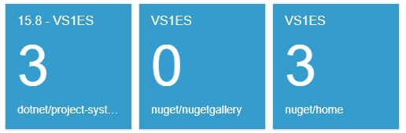
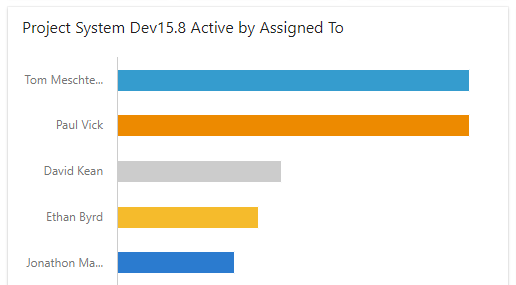

## What is it?

GitHub Dashboard is a simple service that renders basic HTML content about GitHub issues for display in tiles in a VSTS dashboard.  Currently the rendering displays the milestones and/or labels, the count of active issues, and the name of the owner and repo.  Though it's not shown, the content also embeds the GitHub URL so that clicking on the tile will jump to GitHub and show the query results in GitHub's UI.   You can see sample dashboards here:

* [VS1ES Dashboard](https://devdiv.visualstudio.com/DevDiv/Default/_dashboards/Default/9f8c3a82-568d-43b3-8274-cb02b99b253f)
* [Managed Project System](https://devdiv.visualstudio.com/DevDiv/Managed%20Project%20System/_dashboards/Managed%20Project%20System/d354c15c-e023-464c-b2cc-3767fd84c04d)

In these dashboards, the tiles with white foreground pull information from the GitHub Dashboard service.  The [Managed Project System](https://devdiv.visualstudio.com/DevDiv/Managed%20Project%20System/_dashboards/Managed%20Project%20System/d354c15c-e023-464c-b2cc-3767fd84c04d) dashboard also has bar charts issue counts by assignment.

## Who can use the service?
Any team in Visual Studio can power their GitHub dashboard content from this service.  You can read below about setting up your own dashboard that leverages the content from the service.

If you're not in VS, contact [GitHub Dashboard Discussion](mailto:GitHubDash@microsoft.com) to fork the code and create a VSTS dashboard and service instance for your organization.

## Create your own VSTS dashboard and tiles…
Teams in Visual Studio can leverage the GitHub Dashboard service to render content on their team's VSTS dashboard.  Reach out to [GitHub Dashboard Discussion](mailto:GitHubDash@microsoft.com) to let us know of your dependency.  We'll add your contact info to the discussion DL so that you can stay aware of the 'goings on.'

You can read about creating a VSTS dashboard here:  [Add and Manage Dashboards](https://docs.microsoft.com/en-us/vsts/report/dashboards/dashboards?view=vsts&tabs=new-query-exp).  Once you have a dashboard, you'll [add widgets](https://docs.microsoft.com/en-us/vsts/report/dashboards/add-widget-to-dashboard?view=vsts&tabs=new-query-exp) (like tiles) to it.  The Embedded Webpage widget will render the tiles as shown above.  To configure the tile, set the size, then set the URL property to the service's URL with a query string.  The service translates that URL/query string into a GitHub issue query to pull back the rendered content.  Here are two examples:

	https://githubdashboard-dev-as.azurewebsites.net/count/nuget/home?label=VS1ES
	https://githubdashboard-dev-as.azurewebsites.net/count/dotnet/project-system?milestone=15.8&label=VS1ES
	
In the examples above, the base segment of the service's URL is https://githubdashboard-dev-as.azurewebsites.net/count.  Then, 'nuget' or 'dotnet' is the GitHub owner of the repo, and 'home' or 'project-system' is the GitHub repo name.  The query string is the typical form of a name-value pair.  Note that you can have multiple label values.  For instance, you might have a query string like this:  '…?milestone=15.8&label=test&label=bug'.  This is an 'and' so it will render issues with both labels.

## What are the requirements for the service to access your repo?
The obvious requirement is that the service account needs to have read-only access to your repo.

How does my team contribute to the service?
Thanks for your participation!  We prefer an 'open source' community approach for the service.  This way all teams can all leverage the community's new features and bug fixes.

## Here's a rough outline of the steps to get you going:

* Fork (or snap a copy) of the current service repo - < URL to central service repo >
* Create a [personal access token for the command line](https://help.github.com/articles/creating-a-personal-access-token-for-the-command-line/) - name the PAT 'GithubToken'.  The service on your dev box will leverage this PAT for read-only access to the repo.  Note that this is a personal access token - it signs in through your personal GitHub account - protect it appropriately.  Note that for 'dev box scenarios' your personal GitHub account will need at least read access to the repos you want to query.
* Load the solution in VS.
* Install/update the dependent packages:
  * NuGet - you need Oktokit.
  * npm - you need Angular and others.
* Hit F5 - the service's home page will render (though its not interesting) in your default browser.  If you get an authentication exception, you might have missed the PAT step above or maybe a typo in the PAT name…
* Paste in a test query, hit RETURN.
  * A test query is something like this (but with your port number):  http://localhost:49353/count/dotnet/project-system?milestone=15.8&label=test&label=bug.
  * The page should look about like one of the tiles above.  It's more interesting if your repo has some active issues with milestone and/or label values that appear in your query string.
* To ensure you've got the correct tile content, click the rendered page/tile.  You'll jump to GitHub with the query results displayed.  Ideally, the big number in the page/tile matches the count of issues in the GitHub query results.  Here are some common issues:
  * Typos in the milestone and/or label values in the query.
  * Typos in the formatting of the query string.
  * Queries with milestone values that don't exist in the repo.

* If you don't know Angular, I found this to be a good tutorial on the basics:  https://angular.io/tutorial.
* Also, if you need some help with attribute routing in ASP.NET Core, here's a good resource:  https://docs.microsoft.com/en-us/aspnet/core/mvc/controllers/routing?view=aspnetcore-2.0

## Creating your own GitHub dashboard service…
TBP...

## I need more information, who do I contact?
Reach out to [GitHub Dashboard Discussion](mailto:GitHubDash@microsoft.com) if something here is not clear or missing.

